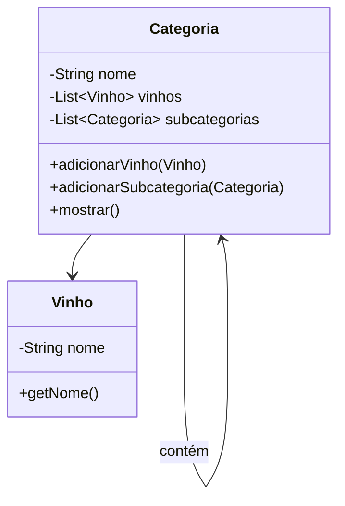
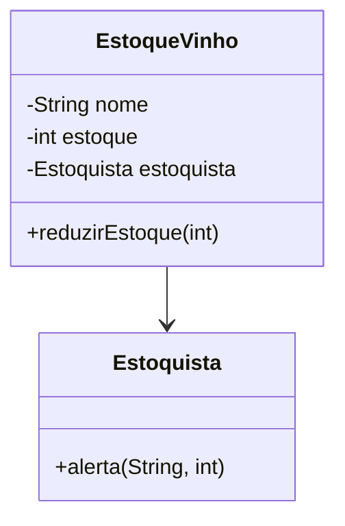
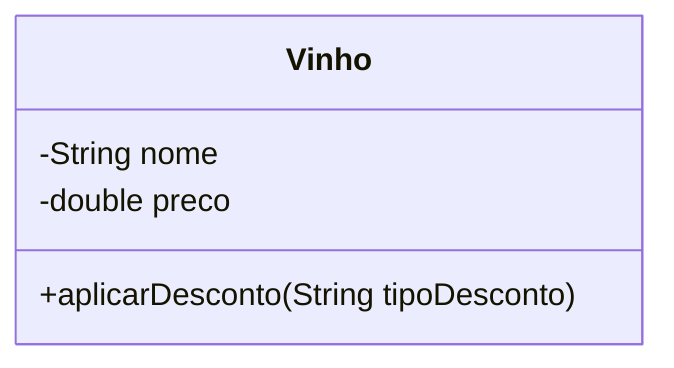

# ❌ AntiPatterns - Projeto Adega de Vinhos 🍷

Este projeto demonstra exemplos de **AntiPadrões de Projeto (AntiPatterns)** usando o mesmo contexto dos padrões bem aplicados: uma **adega de vinhos**. Aqui mostramos como o mal uso de Composite, Observer e Strategy pode comprometer manutenibilidade e escalabilidade.

---

## 📂 AntiComposite

**Problema:** Lógica duplicada, ausência de uma interface comum, forte acoplamento entre categoria e vinho.

### Diagrama UML

---

## 📂 AntiObserver

**Problema:** O objeto estoque está acoplado diretamente ao estoquista, o que quebra o princípio de baixo acoplamento e impede reutilização.

### Diagrama UML

---

## 📂 AntiStrategy

**Problema:** Lógica de desconto baseada em condicionais `if/else`, dificultando manutenção e adição de novas regras.

### Diagrama UML

---

## 💡 Objetivo

Demonstrar que, sem seguir corretamente os padrões de projeto, os sistemas se tornam mais frágeis, acoplados e difíceis de evoluir. Esses exemplos contrastam com a aplicação correta dos padrões `Composite`, `Observer` e `Strategy`.

---