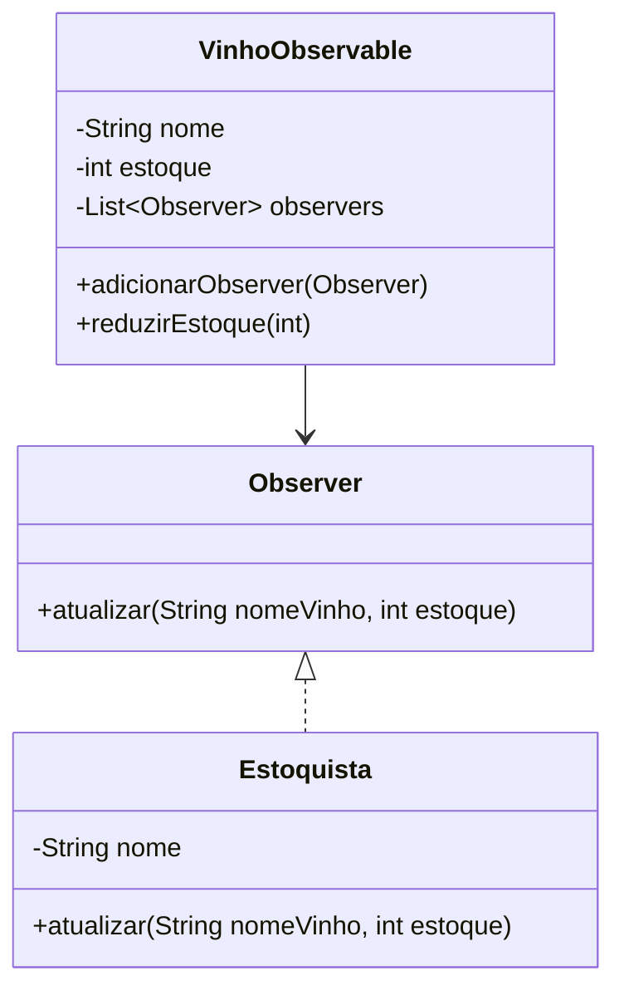
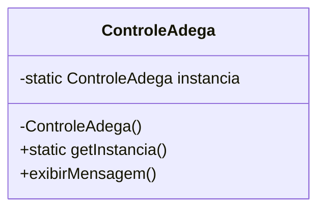
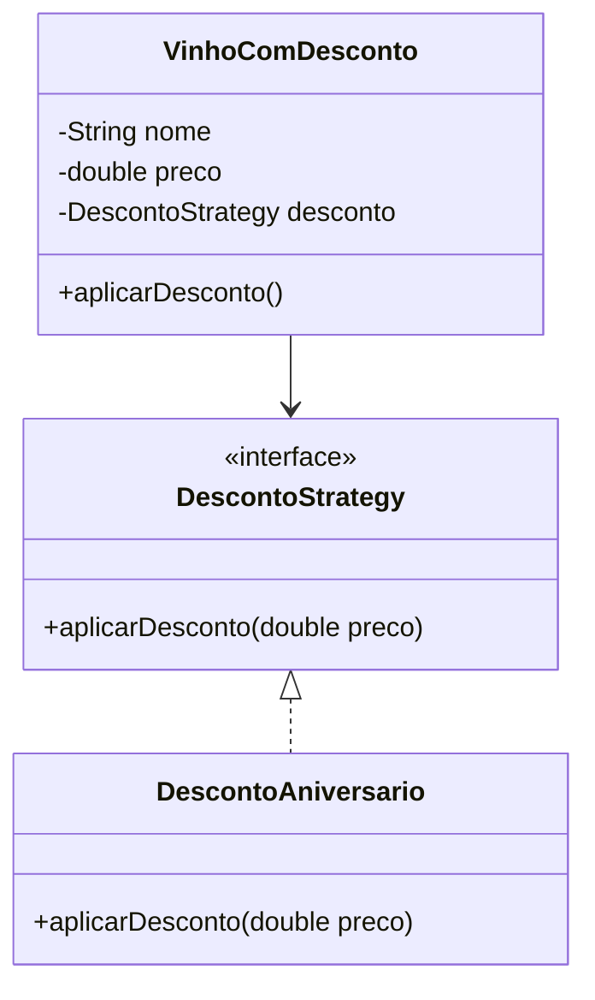
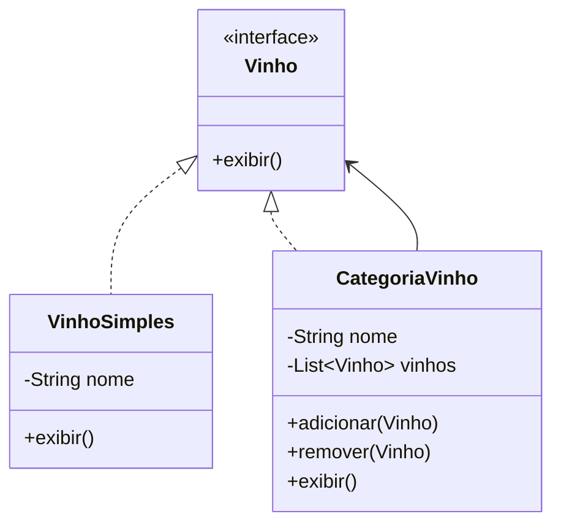

# ✅ Padrões de Projeto - Projeto Adega de Vinhos 🍷

Este projeto demonstra exemplos **corretamente aplicados** de três padrões de projeto clássicos:

- `Observer`
- `Singleton`
- `Strategy`
- `Composite`

---

## 📌 Observer

Permite que objetos observadores sejam notificados quando o estado de um objeto observado muda.

### 🔍 Contexto
A classe `VinhoObservable` notifica os `Estoquistas` quando o estoque do vinho está baixo.

### 📁 Pacote: `observer`

- `Observer`: Interface que define o método `atualizar`.
- `Estoquista`: Implementa o `Observer`, imprimindo alertas.
- `VinhoObservable`: Contém os métodos de controle de estoque e notificação dos observadores.

### 🔧 Funcionamento
```java
VinhoObservable vinho = new VinhoObservable("Cabernet", 5);
vinho.adicionarObserver(new Estoquista("João"));
vinho.reduzirEstoque(4); // Estoque atinge 1 → notifica o estoquista
```

### 🔷 Diagrama UML (Mermaid)


---

## 📌 Singleton

Garante que uma classe tenha apenas uma instância, fornecendo um ponto global de acesso a ela.

### 📁 Pacote: `singleton`

- `ControleAdega`: Garante acesso único ao controle da adega.

### 🔧 Funcionamento
```java
ControleAdega controle = ControleAdega.getInstancia();
controle.exibirMensagem(); // Mensagem de controle único
```

### 🔷 Diagrama UML (Mermaid)


---

## 📌 Strategy

Permite alterar o comportamento de um objeto em tempo de execução através da composição com diferentes estratégias.

### 🔍 Contexto
Aplicação de desconto em vinhos usando diferentes estratégias.

### 📁 Pacote: `strategy`

- `DescontoStrategy`: Interface para aplicar desconto.
- `DescontoAniversario`: Estratégia concreta com 10% de desconto.
- `VinhoComDesconto`: Usa uma estratégia para aplicar desconto no preço.

### 🔧 Funcionamento
```java
DescontoStrategy estrategia = new DescontoAniversario();
VinhoComDesconto vinho = new VinhoComDesconto("Merlot", 100.0, estrategia);
vinho.aplicarDesconto(); // Aplica 10% de desconto
```

### 🔷 Diagrama UML (Mermaid)


---


## 📌 Composite

Permite compor objetos em estruturas de árvore para representar hierarquias parte-todo. Com isso, clientes podem tratar objetos individuais e composições de maneira uniforme.

### 🔍 Contexto
Neste exemplo, temos uma hierarquia de vinhos agrupados por tipo. Uma `CategoriaVinho` pode conter tanto vinhos simples (`VinhoSimples`) quanto outras categorias (composites), como "Tintos", "Brancos", etc.

### 📁 Pacote: `composite`

- `Vinho`: Interface com o método `exibir`.
- `VinhoSimples`: Representa um vinho individual.
- `CategoriaVinho`: Representa uma coleção de vinhos (composite).

### 🔧 Funcionamento
```java
Vinho tinto1 = new VinhoSimples("Cabernet");
Vinho tinto2 = new VinhoSimples("Merlot");

CategoriaVinho tintos = new CategoriaVinho("Tintos");
tintos.adicionar(tinto1);
tintos.adicionar(tinto2);

tintos.exibir(); // Exibe todos os vinhos da categoria
```

### 🔷 Diagrama UML (Mermaid)


---

## 🧠 Conclusão

Esses padrões permitem um sistema desacoplado, extensível e de fácil manutenção. Usando os padrões corretamente, o projeto da adega se torna muito mais sustentável a longo prazo.

---

